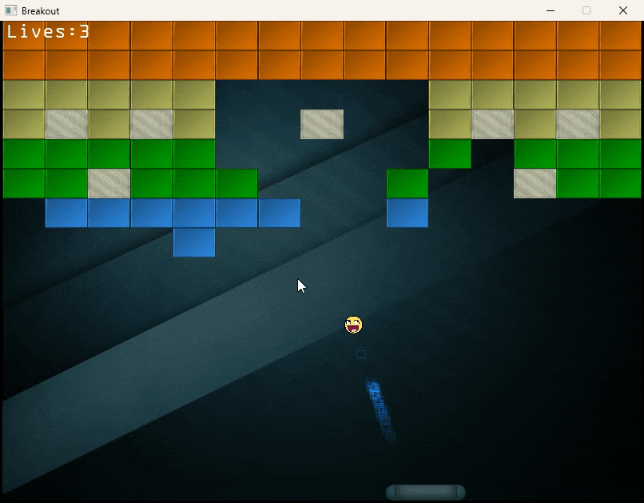

# Breakout Game using OpenGL and GLFW

My attempt at learning the intricate workings of graphics APIs with OpenGL. Based on [Joey De Vries' excellent tutorial](https://learnopengl.com/In-Practice/2D-Game/Breakout).

## How it looks

